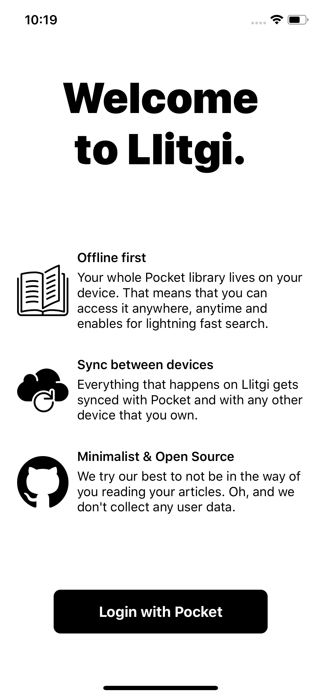
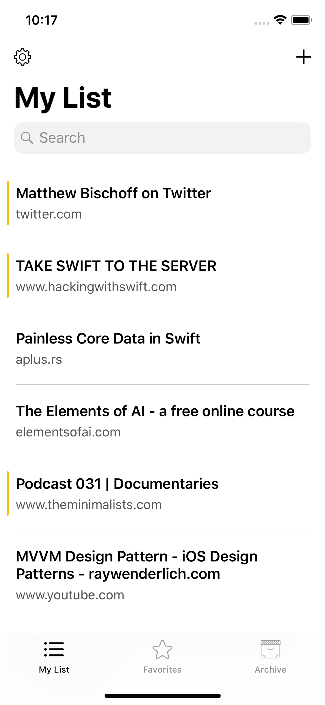
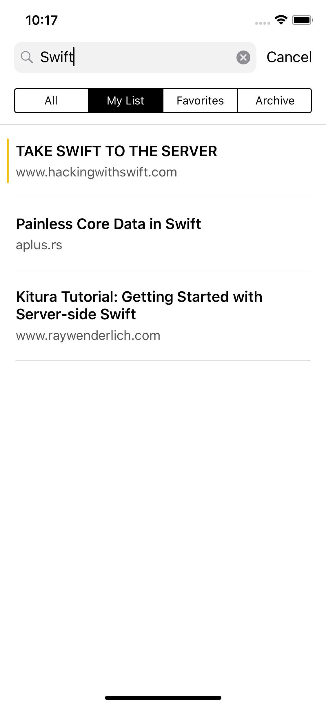
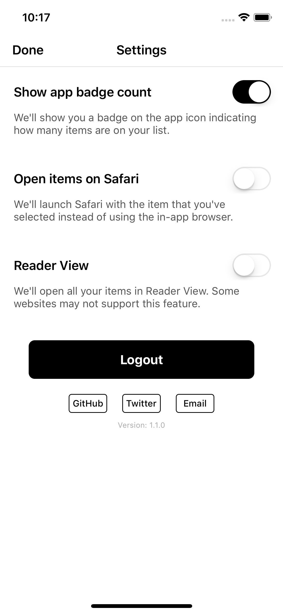

  
   
  
  

## About

Llitgi is a simple & lightweight Pocket client for iOS:

- Offline first 📲
- Blazing fast search 🕵🏻‍♂️
- Gesture driven UI 👈🏻
- Clean and minimal 🌱
- Sync changes with the Pocket API 🚀

## Installation

Llitgi requires you to add a `consumer key` to the project. You can obtain a key by creating a Pocket app on their [website](https://getpocket.com/developer/apps/new.php).
